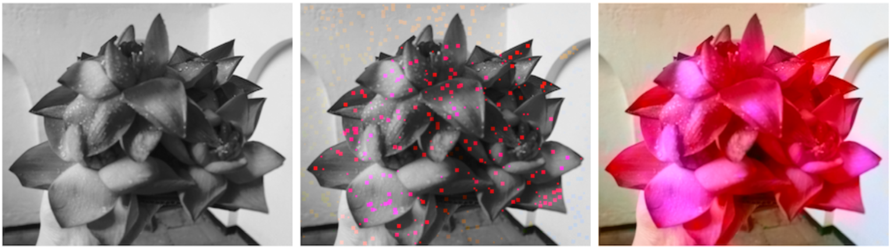
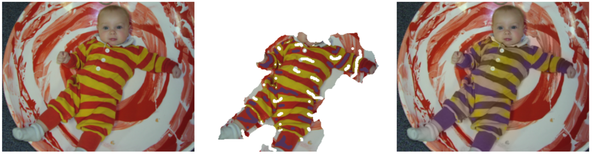

# Colorization Using Optimization

*Programming Assignment 3 for Advanced Computer Graphics at Tsinghua University 2018 Autumn*

Project website: [http](http://www.cs.huji.ac.il/~yweiss/Colorization/)[://www.cs.huji.ac.il/~yweiss/Colorization](http://www.cs.huji.ac.il/~yweiss/Colorization/)[/](http://www.cs.huji.ac.il/~yweiss/Colorization/) 

<video src="./combine.mp4"></video>

### 主要文件说明

* frame.py 定义了基本的类
* color.py 给照片上色的脚本
* video_color.py 按照报告中的第一种方法给视频上色的脚本
* video_dynamic.py 按照报告中的第二种方法（论文中的方法）给视频上色的脚本